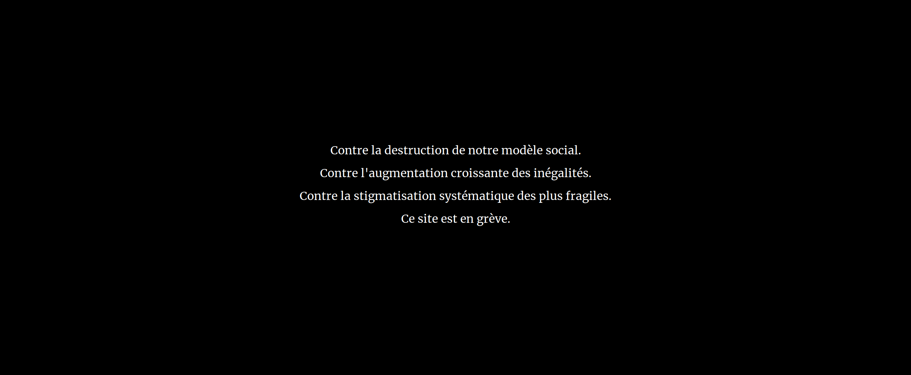

# strike-js

Pour aider votre site à faire grève.



## Qu'est-ce que c'est ?

Ce script est une simple fonction javascript qui vous permet de désactiver
votre site pour une journée.

À la place s'affiche un écran noir et un message en gros caractères blancs.

Le message et la date de grève sont configurables.

Fabriqué avec amour par Thibault Jouannic.
https://www.miximum.fr · [@thibaultj](https://twitter.com/thibaultj/).


## Pourquoi faire ?

Pour les gens qui ne peuvent pas faire grève et qui veulent trouver un autre
moyen de protester.


## Comment s'en servir ?

Strike-js n'utilise aucune dépendance.

Ajoutez ceci à la fin de votre html, juste avant la clôture de la balise
`body` :

```html
    <link rel="stylesheet" href="https://cdn.jsdelivr.net/gh/thibault/strike-js@master/strike.css" type="text/css" charset="utf-8">
    <script src="https://cdn.jsdelivr.net/gh/thibault/strike-js@master/strike.js"></script>
    <script>
        strike(new Date('2019-12-05'), [
            'Contre la destruction de notre modèle social.',
            'Contre l\'augmentation croissante des inégalités.',
            'Contre la stigmatisation systématique des plus fragiles.',
            'Ce site est en grève.',
            '<a href="https://greve.cool/">S\'informer sur la grève</a> · ' +
            '<a href="https://www.infocomcgt.fr/caisse-de-solidarite-financiere/">Participer à la caisse de grève</a>',
            '<small><a href="https://github.com/thibault/strike-js">Mettre votre site en grève</a></small>'
        ]);
    </script>
```

La fonction `strike` prend deux paramètres :

1. la date correspondante au jour de grève ;
2. un tableau contenant une liste de chaînes de caractères qui seront
   insérées dans des balises `<p>`.

Avant et après le jour donné, la fonction est sans effet.

Cet exemple utilise [jsdeliver comme CDN](https://www.jsdelivr.com/?docs=gh)
pour servir les fichiers présents sur ce dépôt, mais vous êtes libre de
récupérer les fichiers pour les servir vous même.

Note 1 : il est possible de passer du html, et notamment des liens `<a>`.

Note 2 : les liens listés dans cette documentation le sont à titre
d'exemple, il ne s'agit pas d'un cautionnement de ma part.


## Comment le tester ?

Pour tester le rendu de votre site avant le jour de grève, vous pouvez ajouter
le paramètre `strikeTest` à votre url.

Exemple : *https://example.com/?strikeTest*

Vous pouvez aussi afficher le fichier [demo.html](./demo.html) dans votre
navigateur.


## Et mon référencement ?

Strike-js utilise une fonction javascript pour ajouter un écran noir qui se
superpose à votre site. Cette fonction est vraisemblablement sans effet pour
les moteurs de recherche, et vous ne devriez subir aucune pénalité de
référencement d'aucune sorte.

Strike-js est toutefois fourni sans garantie, vous l'utilisez sous
votre responsabilité.
